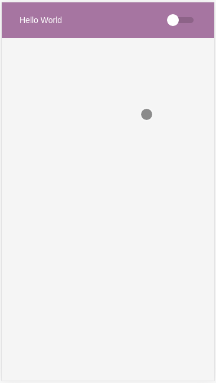

# **THEME PROVIDER**

## **About**

A light/dark theme provider made with React, Styled Components and TypeScript.

Tutorial from Rocketseat channel: https://youtu.be/ngVU74daJ8Y

### **Dependencies**

- node
- yarn
- Styled components
- React
- TypeScript

### **How to run this app example?**

Download it:

```BASH
$ git clone https://github.com/roavellarm/styled-components-theme-provider.git
# or
$ git clone git@github.com:roavellarm/styled-components-theme-provider.git
```

Access the folder and start server:

```BASH
$ cd styled-components-theme-provider
$ yarn start
```

### **Result example**


